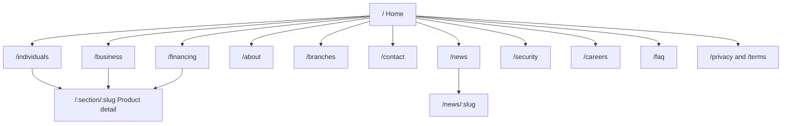
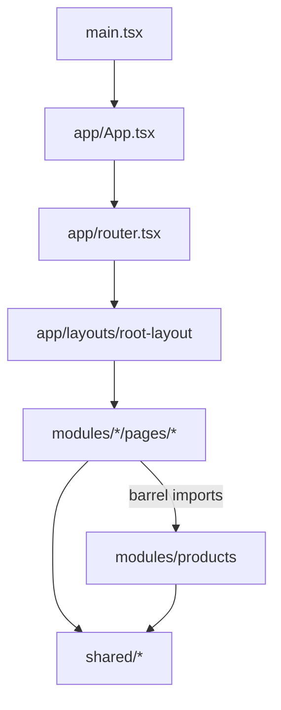

# Ajlan Bank (بنك عجلان) — Frontend Project Plan & PRD Analysis

> Status: approved plan, implemented phase by phase.
> Scope: frontend only (no backend, no authentication, no real transactions).
> Language of the site: Arabic, right-to-left. Language of this document: English.

---

## 1. Product summary

Ajlan Bank is a Yemeni bank that needs an **introductory (informational) website**. The site must:

1. Introduce the bank — who it is, its story, governance, and why it can be trusted.
2. Present services for **individuals** (accounts, cards, personal finance, remittances, digital banking).
3. Present services for **businesses** (corporate accounts, trade finance, cash management, payroll, POS).
4. Present **project financing** (SME, large projects, working capital, equipment) with an indicative calculator.
5. Help visitors **reach the bank** (branches and ATMs, contact form, call center).

The site is not an online-banking portal. Every call to action leads to information, a branch, or a contact channel.

### 1.1 Goals

| Goal | Measure of success |
|------|--------------------|
| Build trust | Clear regulator statement, governance page, security awareness page, consistent calm visual language |
| Explain services quickly | Any product reachable in at most 2 clicks from the home page |
| Drive contact / branch visits | Contact CTA on every product page; branches filterable by city |
| Be fast and accessible | Lighthouse Performance ≥ 90, Accessibility ≥ 95, CLS < 0.1, WCAG AA contrast |
| Be ready to grow | New page = new folder; English = new `*.en.ts` data files; backend = replace service stubs |

### 1.2 Non-goals

- No login, account balances, or transfers.
- No CMS or API in this phase (content is typed static data).
- No dark mode in this phase (tokens are structured so it can be added).

### 1.3 Personas

| Persona | Needs | Primary pages |
|---------|-------|---------------|
| **Individual customer** (salaried employee, student, expatriate family receiving remittances) | Open an account, get a card, receive remittances, understand fees | Individuals, product detail, branches |
| **Business owner / finance manager** | Corporate account, letters of credit, payroll, POS | Businesses, product detail, contact |
| **Entrepreneur / SME** | Financing requirements, documents, expected installment | Financing, calculator, contact |
| **Partner, investor, journalist, job seeker** | Credibility, leadership, news, careers | About, news, careers |

---

## 2. Sitemap



### 2.1 Page-by-page sections

| Route | Page | Sections (in order) |
|-------|------|---------------------|
| `/` | Home | Hero (mission + bank card visual) → Trust figures → Three paths (Individuals / Businesses / Financing) → Featured products → Digital banking → Why Ajlan (values) → Latest news → CTA band |
| `/individuals` | Individuals | Page header → Product groups (Accounts, Cards, Finance, Remittances) → Digital banking strip → FAQ → CTA |
| `/business` | Businesses | Page header → Product grid → How we work with companies (steps) → FAQ → CTA |
| `/financing` | Project financing | Page header → Financing programs → Eligibility → Required documents → How it works (steps) → Indicative calculator → FAQ → CTA |
| `/about` | About | Page header → Story → Vision / Mission → Values → Timeline → Key figures → Leadership → Governance and compliance → CTA |
| `/:section/:slug` | Product detail | Breadcrumbs → Header (name, summary, key facts) → Features → Eligibility → Required documents → FAQ → Related products → CTA |
| `/branches` | Branches & ATMs | Page header → City filter (deep-linkable `?city=`) → Branch list (address, hours, phone, services) |
| `/contact` | Contact | Page header → Channels (call center, email, HQ) → Contact form (frontend validation) |
| `/security` | Security awareness | Page header → "We will never ask you for…" → Tips → Report fraud channel |
| `/news`, `/news/:slug` | Media center | List of news cards → Article page |
| `/careers` | Careers | Page header → Why join → Open positions → How to apply |
| `/faq` | FAQ | Page header → Grouped accordions |
| `/privacy`, `/terms` | Legal | Page header → Structured legal sections |
| `*` | Not found | Message + links to main sections |

---

## 3. Technical stack

| Concern | Choice | Reason |
|---------|--------|--------|
| Build | Vite 8 | Already in the project |
| UI | React 19 + TypeScript 6 | Already in the project; React 19 hoists `<title>`/`<meta>` natively |
| Styling | Tailwind CSS v4 (`@tailwindcss/vite`) | Tokens via `@theme`, logical RTL utilities |
| Routing | `react-router` v7 (data router, lazy routes) | Per-module code splitting, `ScrollRestoration`, search params |
| Class merging | `clsx` + `tailwind-merge` → `cn()` | Safe variant composition |
| Icons | `@phosphor-icons/react` | Recommended by `minimalist-ui`; single weight |
| Motion | CSS + `IntersectionObserver` hook | No animation library needed for subtle motion |
| Forms | Native inputs + a small validation hook | No form library needed |
| Font | IBM Plex Sans Arabic (Google Fonts) | Arabic companion of the banking font recommended by `ui-ux-pro-max` |

---

## 4. Architecture

Based on the **frontend-architecture** skill (feature modules, barrels, promotion ladder), adapted for a content site.



### 4.1 Folder layout

```
src/
  main.tsx
  app/
    App.tsx                    providers + RouterProvider
    router.tsx                 route table (lazy, thin)
    layouts/root-layout/       Header + <Outlet/> + Footer + ScrollRestoration
  modules/
    home/                      Home page
    individuals/               Individuals landing page
    business/                  Businesses landing page
    financing/                 Financing landing page + calculator
    products/                  Product catalog (all sections) + product detail page + ProductCard
    about/
    branches/
    contact/                   includes services/contact.service.ts (stub)
    news/
    security/
    careers/
    faq/
    legal/                     privacy + terms
    not-found/
  shared/
    components/
      ui/                      Button, ButtonLink, Card, Container, Section, SectionHeading,
                               Badge, Accordion, Icon, Reveal, PageHero, CtaBanner, IconTile, StatList
      layout/                  Header, MobileNav, Footer, Breadcrumbs, SkipLink, Logo, Seo
    hooks/                     useReveal, useScrolled
    utils/                     cn, format (Intl, Western digits)
    data/site.ar.ts            brand, navigation, contact, legal, key figures
    i18n/locale.ts             DEFAULT_LOCALE, DIR
    constants/routes.ts        every path in one place
    types/                     shared interfaces (INavItem, IFaqItem, ISeoMeta, ...)
    styles/                    tokens.css, base.css, motion.css
```

Each module follows the same internal shape:

```
modules/<feature>/
  index.ts                     public barrel — the only import entry point
  README.md                    what it owns, its routes, its data
  data/<name>.ar.ts            typed Arabic content (one file per page or content group)
  types/                       module interfaces
  pages/<page>/
    <page>.tsx                 composition only
    <page>.styles.ts           all class strings for this page
    index.ts
    components/                sections used only by this page (each with its own .styles.ts)
    hooks/                     hooks used only by this page
  components/                  used by 2+ pages of this module
  utils/                       pure functions
  services/                    data access (stubs today, API tomorrow)
```

### 4.2 Rules

1. **Single responsibility.** A file does one thing: a page composes, a section renders, a data file holds content, a styles file holds classes, a hook holds behavior.
2. **No literal copy in JSX.** Every visible string comes from a `*.ar.ts` data file (shared UI strings live in `shared/data/site.ar.ts`).
3. **Barrels only across modules.** `import { ProductCard } from '@/modules/products'` — never a deep path.
4. **Promotion ladder.** page → module → `shared` only when a second consumer exists.
5. **Styles are co-located.** `*.styles.ts` exports named class strings; no inline `style={{}}`.
6. **Interfaces are `I`-prefixed**; union aliases are not (`type ProductSection = 'individuals' | 'business' | 'financing'`).
7. **Design tokens only.** Tailwind default colors are disabled; components use semantic tokens (`bg-canvas`, `text-ink`, `border-line`).
8. **RTL-first.** Only logical utilities (`ms-*`, `me-*`, `ps-*`, `pe-*`, `start-*`, `end-*`, `text-start`). Directional icons flip with `rtl:-scale-x-100`.

### 4.3 Internationalization readiness (i18n-localization skill)

- Arabic content is in `*.ar.ts` files typed by interfaces. Adding English = adding `*.en.ts` files with the same interface plus a locale selector.
- `shared/i18n/locale.ts` holds `DEFAULT_LOCALE = 'ar'` and `DIR = 'rtl'`.
- Numbers and currency use `Intl.NumberFormat('ar-YE-u-nu-latn')` (Arabic formatting, Western digits for financial clarity). Dates use `Intl.DateTimeFormat`.

---

## 5. Design system summary

The full visual specification lives in [`DESIGN.md`](../DESIGN.md). Summary:

- **Style:** Minimalism & Swiss, "Trust & Authority" landing pattern (from `ui-ux-pro-max --design-system`).
- **Palette:** flat soft purple (brand) + warm beige (canvas). **No gradients anywhere.**
- **Shadows:** near-invisible, purple-tinted (`rgba(42,29,71,0.04–0.06)`).
- **Typography:** IBM Plex Sans Arabic, 16px base, 1.7 line height.
- **Shapes:** 8px inputs/buttons, 12px cards, 16px large panels.
- **Motion:** subtle reveal (600ms, 12px), 200ms hover, reduced-motion respected.

---

## 6. Skills map (which skill drives which phase)

| Skill (in `.cursor/`) | Used for |
|-----------------------|----------|
| `ui-ux-pro-max` | Design-system search (pattern, style, font, motion), landing structure, UX priorities, pre-delivery checklist |
| `awesome-design-md` (`wise`, `stripe`) | Structure and depth of `DESIGN.md` |
| `frontend-architecture` | Module/page/barrel structure, promotion ladder, naming |
| `minimalist-ui` | Flat surfaces, 1px borders, restrained shadows, editorial whitespace, Phosphor icons |
| `anti-slop-design` | No gradients, no emoji icons, no vanity stats, no screaming eyebrows, varied layouts |
| `tailwind-design-system` | `@theme` tokens, semantic colors, variants |
| `i18n-localization` | RTL, logical properties, typed locale data, Intl formatting |
| `ui-motion`, `review-animations` | Motion timings, easing, reduced motion |
| `frontend-seo`, `seo-schema` | Per-route metadata, canonical, Open Graph, JSON-LD (`BankOrCreditUnion`) |
| `ux-copy` | Button labels as actions, helpful errors, calm money copy |
| `fixing-accessibility`, `ui-a11y` | Focus, labels, landmarks, contrast, 44px targets |
| `react-best-practices`, `web-performance-optimization` | Lazy routes, no unnecessary re-renders, font preconnect |
| `.cursor/rules/*.mdc` | Always-on project rules (rewritten for this bank) |

---

## 7. Content strategy

- Formal, clear Modern Standard Arabic; calm tone for money topics; no clichés, no emojis, no placeholder names.
- Context: **Yemen** — Yemeni rial (YER) and USD accounts, Central Bank of Yemen as regulator, branches in Sana'a, Aden, Taiz, Mukalla, Hodeidah, and Ibb.
- **Placeholders that must be replaced with real values before launch** are grouped in `shared/data/site.ar.ts` (`legal` and `contact` objects): license number, SWIFT code, commercial registration, phone numbers, and key figures.
- Financial calculator results are labeled as indicative only.
- The contact form is frontend-only; `modules/contact/services/contact.service.ts` is the single integration point for a future API.

---

## 8. SEO & accessibility

- `Seo` component per page: unique Arabic `<title>`, description, canonical, Open Graph, Twitter card.
- JSON-LD `BankOrCreditUnion` on Home and About; `BreadcrumbList` on product pages.
- One `h1` per page, logical heading order, landmarks (`header`, `nav`, `main`, `footer`), skip link.
- Visible `:focus-visible` ring, 44px minimum targets, labeled fields with errors next to the field.
- WCAG AA contrast for all text tokens (verified in `DESIGN.md`).

---

## 9. Phases and acceptance criteria

| # | Phase | Deliverables | Done when |
|---|-------|--------------|-----------|
| 0 | Docs | `docs/PROJECT_PLAN.md`, `DESIGN.md`, rewritten `.cursor/rules` | Documents reviewed |
| 1 | Foundation | Tailwind plugin, `@/` alias, RTL `index.html`, font, tokens/base/motion CSS, dependencies, boilerplate removed | `npm run build` passes; blank RTL page renders with tokens |
| 2 | Shared kit & layout | UI primitives, Header + MobileNav, Footer, Seo, Reveal, site data | Layout works 320–1440px, keyboard navigable |
| 3 | Home | All home sections | Matches section order in §2.1 |
| 4 | Individuals + product detail | Landing + `/:section/:slug` template + catalog | Every individual product has a detail page |
| 5 | Businesses | Landing + catalog entries | Every business product has a detail page |
| 6 | Financing | Landing + calculator | Calculator gives correct amortized installment |
| 7 | About | All about sections | JSON-LD present |
| 8 | Supporting pages | Branches, Contact, Security, News, Careers, FAQ, Legal, 404 | All routes reachable from header/footer |
| 9 | QA | Checklist below | Lint, typecheck, and build pass |

### 9.1 QA checklist (ui-ux-pro-max pre-delivery + project rules)

- [ ] No emojis; all icons are Phosphor SVG with one weight
- [ ] No gradients anywhere (`rg "gradient" src` returns nothing)
- [ ] All clickable elements have hover, focus-visible, and active states; `cursor-pointer`
- [ ] Text contrast ≥ 4.5:1
- [ ] `prefers-reduced-motion` disables reveal and hover motion
- [ ] Responsive at 320, 375, 768, 1024, 1440px; no horizontal scroll
- [ ] Only logical (RTL-safe) spacing utilities
- [ ] Every route has unique title/description/canonical
- [ ] `npm run lint` and `npm run build` pass

---

## 10. Future extensions

- English locale (`*.en.ts` + language switcher, `dir` toggle).
- Headless CMS behind the existing data interfaces.
- Contact/branch APIs behind `services/`.
- Exchange-rate widget (requires an authoritative source; must show update time).
- Dark mode via a second token set.
